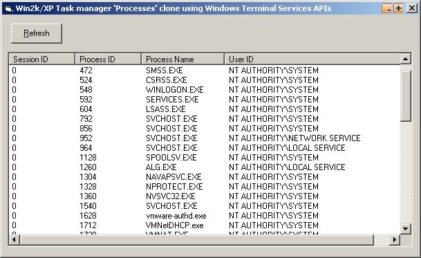



## NT Task Manager 'Processes' clone using Windows Terminal Services APIs

### Description

This isn't a task manager clone, but it does show all the information from the Processes window (well, process id, session id, user id, process name). I didn't actually code 90% of this so please don't vote for it, I just added the username lookup routine.. This code is from microsoft's msdn collection which i stumbled on in my journies. The main benifit of this to me is to enumerate the users currently logged on to a Windows 2000/XP machine. And specificly to find the active username if you are logged on as a service.. but that's another story. (ps I don't use this to find that out but this is what I found while looking for that)..

Code is not to complex, apart from a few pointers.
 
### More Info
 
Requires Windows 2000/XP.. Will not work in Win98 as it is not a terminal service operating system.

             |
---                |---
**Submitted On**   |2002-04-12 19:56:14
**By**             |[SKoW](https://github.com/Planet-Source-Code/PSCIndex/blob/master/ByAuthor/skow.md)
**Level**          |Intermediate
**User Rating**    |4.7 (33 globes from 7 users)
**Compatibility**  |VB 6\.0
**Category**       |[Windows API Call/ Explanation](https://github.com/Planet-Source-Code/PSCIndex/blob/master/ByCategory/windows-api-call-explanation__1-39.md)
**World**          |[Visual Basic](https://github.com/Planet-Source-Code/PSCIndex/blob/master/ByWorld/visual-basic.md)
**Archive File**   |[NT\_Task\_Ma712544122002\.zip](https://github.com/Planet-Source-Code/skow-nt-task-manager-processes-clone-using-windows-terminal-services-apis__1-33724/archive/master.zip)

